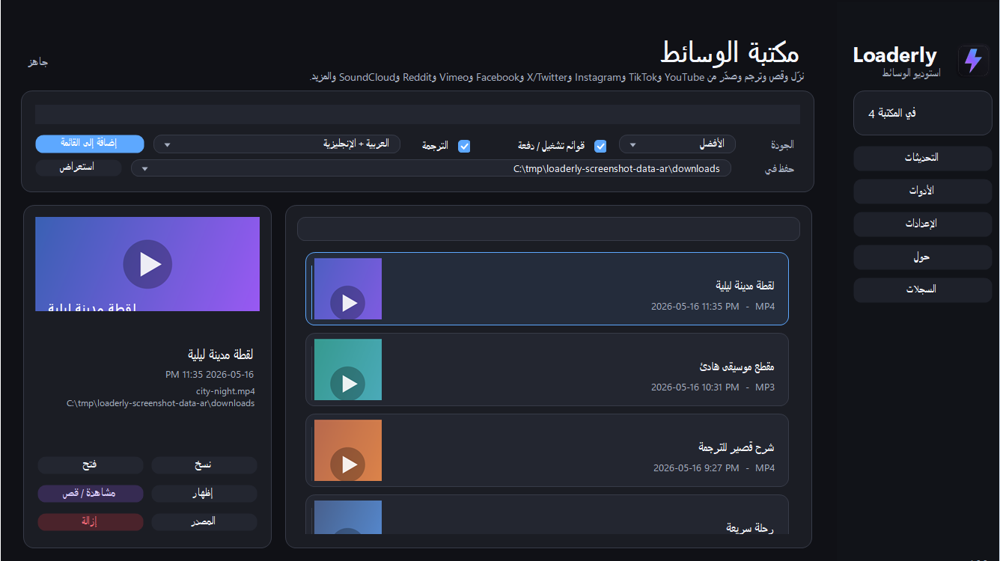

<div align="center" dir="rtl">
  

  <h1>Loaderly</h1>

  <p>
    <strong>تطبيق ويندوز لتحميل الوسائط وتنظيمها وقصها والعمل على الترجمة وتصديرها من مكان واحد.</strong>
  </p>

  <p>
    <a href="README.md">English</a>
  </p>

  <p>
    <a href="https://github.com/voidksa/Loaderly/releases/latest"></a>
    
    
    
  </p>
</div>

<p align="center" dir="rtl">
  <a href="https://github.com/voidksa/Loaderly/releases/latest"><strong>تحميل Loaderly لويندوز</strong></a>
</p>

<p align="center">
  
</p>

<p align="center">
  
</p>

## ماذا يفعل Loaderly؟

Loaderly يجمع التعامل مع روابط الوسائط في تطبيق واحد على ويندوز. الصق الرابط، حمّل الملف، احتفظ به في مكتبة محلية، قص الجزء الذي تحتاجه، عدّل الترجمة، ثم صدّر النتيجة بدون التنقل بين أدوات كثيرة.

## المزايا

- تحميل من YouTube وTikTok وInstagram وX/Twitter وFacebook وVimeo وReddit وSoundCloud ومواقع أخرى مدعومة.
- إضافة رابط واحد، دفعات متعددة الأسطر، أو قوائم تشغيل إلى قائمة الانتظار.
- مكتبة محلية مع صور مصغرة، روابط المصدر، إجراءات الملفات، حفظ العناوين الصحيحة، وفتح المشاهدة أو القص.
- إضافة فيديوهات من جهازك إلى المكتبة وتعديلها بنفس أدوات القص والترجمة واللقطة والبلور والزوم.
- متابعة التنزيل بنسبة التقدم، الحجم المحمل/الإجمالي، السرعة، والوقت المتبقي عند توفرها من المزود.
- قص المقاطع مع حذف أجزاء داخلية، حفظ حالة التعديل، قائمة كلك يمين على القصات، قص مباشر بدون انتقالات، وBlur لإخفاء جزء من الفيديو، وZoom للتركيز على منطقة محددة.
- تحميل ملفات الترجمة وتعديلها وترجمتها وتنسيقها وإخفاؤها واستعادتها ودمجها مع الفيديو، مع صور مصغرة في تايملاين محرر الترجمة.
- التحديث من GitHub Releases مباشرة من داخل التطبيق؛ Loaderly ينزل المثبت، يغلق التطبيق المفتوح، يثبت التحديث، ثم يعيد فتحه بعد الانتهاء.
- واجهة عربية أو إنجليزية مع الوضع الفاتح أو الداكن أو وضع النظام.

## الإصدار 1.1.0

Loaderly 1.1.0 إصدار ميزات يركز على جعل التحميل والقص والترجمة أوضح وأسهل للمستخدم العادي.

الجديد في الإصدار:

- حقل روابط أكبر ومتعدد الأسطر للصق أكثر من رابط، كل رابط في سطر.
- إضافة فيديوهات محلية من جهازك بزر واضح أو بسحب ملف الفيديو وإفلاته داخل Loaderly.
- كروت التنزيل تعرض التقدم بشكل أوضح: النسبة، الحجم، السرعة، والوقت المتبقي عند توفرها.
- حفظ عناوين الفيديو بشكل أفضل، بما فيها العناوين العربية واللغات الأخرى.
- ترتيب كروت المكتبة بشكل أنظف مع عناوين أوضح وتقليل النصوص المقصوصة.
- القص يدعم حذف أجزاء داخلية من المقطع، مو بس القص من البداية أو النهاية.
- تقدر تحدد أجزاء القص من التايملاين أو تضغط عليها كلك يمين لإجراءات سريعة.
- القصات صارت تنتقل مباشرة بدون تأثيرات انتقال عشان المعاينة تكون أسرع وأسهل.
- الضغط على أي مكان في تايملاين القص ينقل المؤشر الأبيض له، والسحب داخل التحديد ما زال يحرك التحديد نفسه.
- أي قص أو بلور أو زوم جديد ينضاف عند المؤشر الأبيض ويحاول يتجنب العناصر الموجودة بجانبه عشان ما يدخلون في بعض.
- تقدر تقرب التايملاين بـ `Ctrl+عجلة الماوس`، وبعدها تتحرك يمين ويسار بـ `Shift+عجلة الماوس` أو `Shift+سحب` أو السحب بزر الماوس الأوسط.
- تقدر تضيف بلور على جزء معين من الفيديو لمدة تختارها، وتشوفه مباشرة في التايملاين الأكبر، وتسحب علامة البلور الخضراء لتغيير توقيته، وتتحكم بالقوة وتحرك مربع البلور وتكبره من الزوايا، وبعدها تضغط تثبيت عشان يثبت، وتقدر ترجع له بتخصيص أو تضيف حركة جديدة إذا الشي اللي تخفيه يتحرك.
- البلور العادي والبلور الناعم والبكسلة تظهر في المعاينة كتأثير فعلي، مو مجرد مربع شفاف فوق الفيديو.
- زر تتبع يساعدك يخلي البلور يتبع الوجه أو الجسم أو الشي المحدد أثناء تحرك الفيديو.
- تقدر تضيف زوم على منطقة معينة من الفيديو لمدة تختارها، وتحدد قوة التقريب، وتشوف النتيجة مباشرة في المعاينة، وتستخدم تتبع أو تثبيت إذا المنطقة تتحرك مع الشخص أو الشي.
- زر لقطة يحفظ صورة ثابتة من إطار المعاينة الحالي.
- تقدر تختار اسم ملف المقطع قبل حفظ التصدير.
- بعد حفظ المقطع أو نسخه أو أخذ لقطة، تظهر لك إجراءات سريعة لفتح الملف أو فتح مجلده أو نسخ مساره.
- المكتبة توضح لك إذا الفيديو له قص أو بلور أو زوم محفوظ سابقا.
- Loaderly ينبهك قبل الإغلاق إذا فيه تنزيل أو تصدير ما زال يعمل.
- شغلك في القص ينحفظ محليا، وإذا رجعت لنفس الفيديو يرجع لك القص والتحديد.
- تحريك التايملاين والتنقل بالكيبورد صار أنعم في القص ومحرر الترجمة.
- محرر الترجمة يعرض صور التايملاين ويسهل ضبط توقيت الجمل اليدوية.
- تقدر تنشئ ترجمة يدوية من مكان الخط الحالي، ثم تضبطها بـ Set start وSet end وتشغل الجملة فقط بـ Play cue.
- الإعدادات فيها روابط مباشرة لـ OpenRouter للحصول على API key واختيار الموديلات.
- نوافذ Settings وTools صارت أرتب وأصغر وما تحتاج فل سكرين.
- المثبت يعرض تقدم التثبيت والملفات أثناء النسخ.
- التحقق من التحديثات داخل البرنامج يقدر ينزل مثبت آخر إصدار من GitHub Releases ويبدأ التحديث مباشرة.

اختصارات مفيدة:

- حقل الروابط: `Ctrl+Enter` يضيف الروابط للانتظار. `Enter` و`Shift+Enter` ينزلون سطر جديد.
- القص: `Space` تشغيل/إيقاف، الأسهم خطوة 0.25 ثانية، `Shift+سهم` ثانية واحدة، `Ctrl+سهم` يحدد البداية أو النهاية، `Ctrl+Shift+سهم` إطار بإطار.
- القص: `Ctrl+Z` تراجع، `Ctrl+Shift+Z` أو `Ctrl+Y` إعادة، `Delete` يحذف القص المحدد، `M` كتم الصوت، `Ctrl+S` حفظ، `Ctrl+R` إعادة ضبط، `Esc` إغلاق.
- البلور في القص: زر `إضافة` يضيف منطقة بلور، اسحب علامة البلور الخضراء في التايملاين لتغيير وقت ظهوره، واسحب المربع فوق الفيديو، كبره أو صغره من الزوايا أو بعجلة الماوس، `تثبيت` يثبته، `تخصيص` يرجعك لتعديله، `Delete` يحذف البلور المحدد، و`تتبع` يحاول يتبع الوجه أو الشي المحدد تلقائيا.
- الزوم في القص: زر `إضافة` يضيف منطقة زوم، اسحب علامة الزوم في لاينها داخل التايملاين، اختر قوة التقريب، `تثبيت` يثبتها، `تخصيص` يرجعك لتعديلها، `Delete` يحذف الزوم المحدد، و`تتبع` أو `تثبيت` تفيد إذا الشي يتحرك.
- محرر الترجمة: `Ctrl+Enter` يضيف الجملة التالية، `[` يحدد بداية الجملة، `]` يحدد نهايتها، `Delete` يحذف الجملة المحددة.
- محرر الترجمة: `Space` تشغيل/إيقاف، الأسهم خطوة، `Shift+سهم` خمس ثواني، `Ctrl+Shift+سهم` إطار بإطار، `Ctrl+S` حفظ.

## التحميل

حمّل مثبت ويندوز من آخر إصدار:

<p align="center" dir="rtl">
  <a href="https://github.com/voidksa/Loaderly/releases/latest">
    
  </a>
</p>

بعد التحميل شغّل المثبت، ثم افتح Loaderly من قائمة Start. يفضّل استخدام Windows 10 أو أحدث.

## الوصول المبكر

الإصدارات العامة تنشر على GitHub. إذا تبغى توصل لنسخ حصرية قبل الإطلاق العام، تقدر تشترك بعضوية Loaderly عبر [Buy Me a Coffee](https://buymeacoffee.com/voidksa).

## متطلب Media Player

ميزة Watch / Trim تعتمد على مكونات تشغيل الوسائط في ويندوز لعرض معاينة الفيديو. إذا ظهرت رسالة `Windows Media Player version 10 or later is required.` عند فتح Watch / Trim، فهذا يعني غالبًا أن ميزة Windows Media Player الاختيارية غير مثبتة حتى لو كان تطبيق Media Player الجديد موجودًا.

افتح PowerShell أو Command Prompt كمسؤول، شغّل هذا الأمر، ثم أعد تشغيل ويندوز:

```powershell
DISM /Online /Add-Capability /CapabilityName:Media.WindowsMediaPlayer~~~~0.0.12.0
```

يمكنك أيضًا تثبيت أو تحديث Media Player من Microsoft Store، لكن أمر DISM بالأعلى هو الحل للمكوّن الناقص داخل ويندوز:

<p align="center" dir="rtl">
  <a href="https://apps.microsoft.com/detail/9WZDNCRFJ3PT">
    <br>
    <strong>تثبيت Media Player من Microsoft Store</strong>
  </a>
</p>

إذا كان الجهاز يعمل بإصدار Windows N واستمرت المشكلة بعد الأمر، ثبّت Microsoft Media Feature Pack أيضًا.

## الخصوصية

Loaderly يحفظ إعدادات التطبيق، سجل التنزيلات، الصور المصغرة، تفضيلات الترجمة، وبيانات المكتبة المحلية على جهازك. ميزات تنزيل الوسائط أو البحث عن التحديثات أو ترجمة الترجمة قد تتصل بالخدمات المطلوبة فقط عند استخدامها.

لا تنشر مفاتيح API الشخصية أو بيانات الدخول أو شهادات التوقيع أو ملفات الإعدادات الخاصة.

## توفر المصدر

هذا المستودع متاح للاطلاع على المشروع واستخدامه ضمن الأغراض غير التجارية المسموحة في الترخيص. الطريقة الموصى بها لاستخدام Loaderly هي تحميل مثبت ويندوز الرسمي من صفحة الإصدارات.

الاستخدام التجاري، إعادة البيع، الاستضافة المدفوعة، إعادة التسمية، أو نشر Loaderly كمنتج آخر يتطلب إذنًا كتابيًا من صاحب الحقوق.

## الترخيص

Loaderly متاح المصدر تحت ترخيص [PolyForm Noncommercial License 1.0.0](LICENSE.md).
