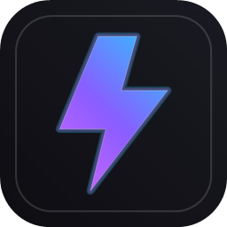
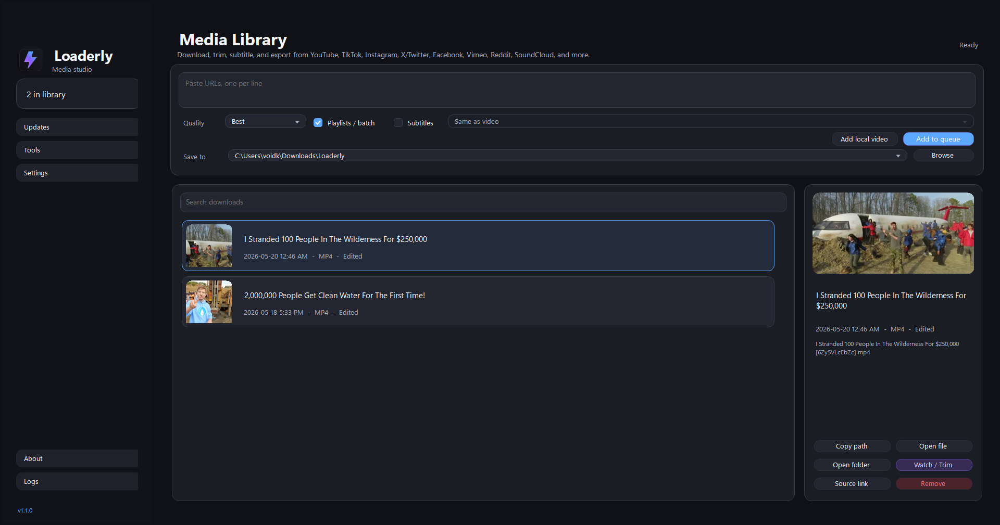
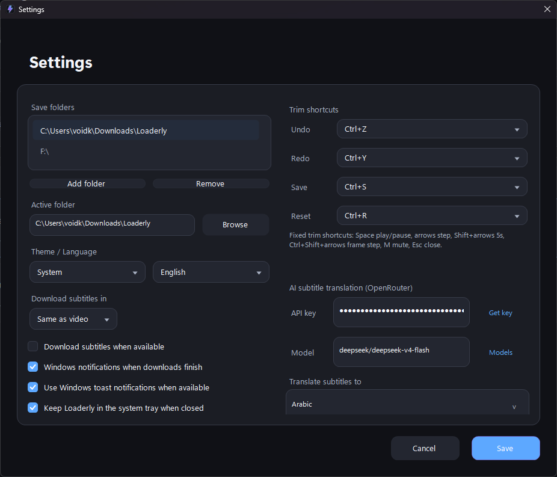

<div align="center">
  

  <h1>Loaderly</h1>

  <p>
    <strong>A Windows desktop app for downloading, organizing, trimming, subtitling, and exporting online media.</strong>
  </p>

  <p>
    <a href="README.ar.md">العربية</a>
  </p>

  <p>
    <a href="https://github.com/voidksa/Loaderly/releases/latest"></a>
    
    
    
  </p>
</div>

<p align="center">
  <a href="https://github.com/voidksa/Loaderly/releases/latest"><strong>Download Loaderly for Windows</strong></a>
</p>

<p align="center">
  
</p>

<p align="center">
  
</p>

## What Loaderly Does

Loaderly gives you one desktop workspace for media links. Paste a URL, download the file, keep it in a local library, trim the part you need, work with subtitles, and export the result without jumping between separate tools.

## Highlights

- Download from YouTube, TikTok, Instagram, X/Twitter, Facebook, Vimeo, Reddit, SoundCloud, and other supported sites.
- Add single links, batches, and playlists to the queue.
- Keep a local media library with thumbnails, source links, file actions, and watch/trim access.
- Trim clips, copy files, open folders, and export the final result.
- Load, edit, translate, style, hide, restore, and burn subtitles.
- Use the app in English or Arabic with light, dark, or system theme modes.

## Download

Download the Windows installer from the latest release:

<p align="center">
  <a href="https://github.com/voidksa/Loaderly/releases/latest">
    
  </a>
</p>

Run the installer and open Loaderly from the Start menu. Windows 10 or newer is recommended.

## Media Player Requirement

Watch / Trim uses Windows media components for video preview. If Watch / Trim shows `Windows Media Player version 10 or later is required.`, the Windows Media Player optional feature is missing even if the newer Media Player app is installed.

Open PowerShell or Command Prompt as administrator, run this command, then restart Windows:

```powershell
DISM /Online /Add-Capability /CapabilityName:Media.WindowsMediaPlayer~~~~0.0.12.0
```

You can also install or update Media Player from Microsoft Store, but the DISM command above is the fix for the missing Windows capability:

<p align="center">
  <a href="https://apps.microsoft.com/detail/9WZDNCRFJ3PT">
    <br>
    <strong>Install Media Player from Microsoft Store</strong>
  </a>
</p>

On Windows N editions, install the Microsoft Media Feature Pack too if Media Player does not appear or playback still fails after the command.

## Privacy

Loaderly keeps its app settings, download history, thumbnails, subtitle preferences, and local library data on your device. Features that download media, check for updates, or translate subtitles may contact the relevant online services only when you use them.

Do not publish personal API keys, credentials, signing certificates, or private configuration files.

## Source Availability

This repository is provided so users can inspect the project and use it for permitted noncommercial purposes. The recommended way to use Loaderly is the official Windows installer from the release page.

Commercial use, resale, paid hosting, rebranding, or publishing Loaderly as another product requires written permission from the copyright holder.

## License

Loaderly is source-available under the [PolyForm Noncommercial License 1.0.0](LICENSE.md).
